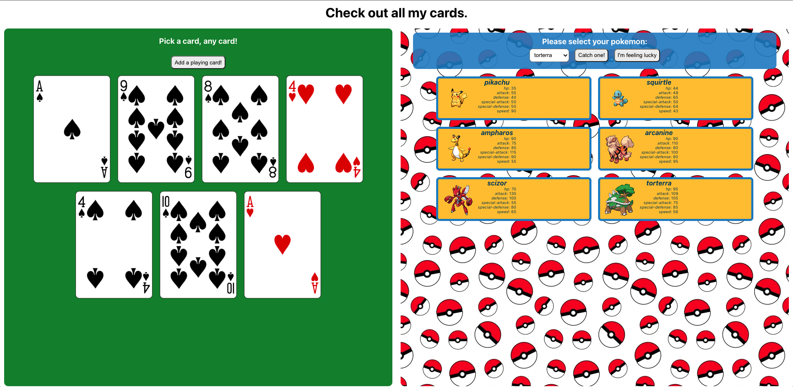

# React Pokemon Cards

### This exercise will give you practice writing your own custom hooks. We’ve provided you with an app, but the code could use some refactoring.

## Step One: Read the Code

The app uses two APIs, the Deck of Cards API and the Pokemon API, to generate different types of cards on the page.

Play around with the app to get a sense for how it works. Draw out the component hierarchy in your pair and make sure you understand how all of the pieces fit together.

## Step Two: _**useFlip**_

Both the _**PokemonCard**_ and the _**PlayingCard**_ components can be flipped over when clicked on. You may have noticed that there is some duplicate code in these components. Create a _**hooks.js**_ file in _**src/**_, and in that file write a custom hook called _**useFlip**_ which will hold the business logic for flipping any type of card.

_**useFlip**_ doesn’t need to take an argument, and similar to useState, it should return an array with two elements. The first element is the current flip state of the card, and the second element is a function that will toggle the flip state.

Once you’ve written this hook, refactor _**PokemonCard**_ and _**PlayingCard**_ to use this custom hook.

## Step Three: _**useAxios**_ in _**PlayingCardList**_

In the _**PlayingCardList**_ component, we initialize an empty array in state, and add to it via an AJAX request we make with _**axios**_. Since we use _**axios**_ in a few components, let’s move this logic into a function called _**useAxios**_.

_**useAxios**_ should take in a URL, and similar to useState, it should return an array with two elements. The first element is an array of data obtained from previous AJAX requests (since we will add to this array, it’s a piece of state). The second element is a function that will add a new object of data to our array.

Once you’ve written this hook, refactor _**PlayingCardList**_ to use this custom hook. (Don’t worry about _**Pokedex**_ for now - that’s coming in the next part!

## Step Four: _**useAxios**_ in _**Pokedex**_

_**Pokedex**_ also make AJAX requests, but this one’s a bit trickier. _**PlayingCardList**_ makes a request to the same endpoint every time, but the endpoint in _**Pokedex**_ depends on the name of the pokemon.

Figure out a way to modify your _**useAxios**_ hook so that when you call _**useAxios**_ you can just provide a base url, and when you want to add to your array of response data in state, you can provide the rest of the url.

Once you’ve done this, refactor _**Pokedex**_ to use _**useAxios**_. Make sure _**PlayingCardList**_ still works too!

## Further Study: Removing response data

Add two buttons to the page: one that will erase all of the playing cards in state, and one that will erase all of the pokemon cards.

Since these arrays are controlled from within the _**useAxios**_ hook, one way to approach this would be to have _**useAxios**_ have a third element in its return array: a function that will remove everything from the array in stat